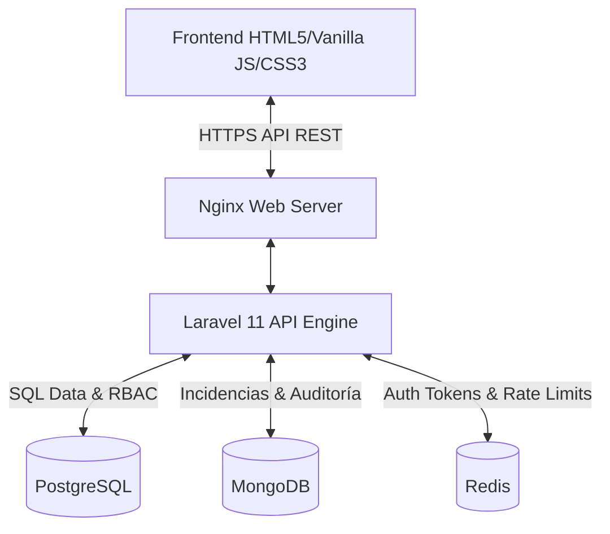

# Sistema de Incidencias Georreferenciadas

[](https://laravel.com)
[](https://www.docker.com)
[](https://www.postgresql.org)
[](https://www.mongodb.com)
[](https://redis.io)

Plataforma empresarial para el reporte, seguimiento y gestión de incidencias urbanas georreferenciadas. Diseñada bajo un enfoque robusto de seguridad, alto rendimiento y separación de responsabilidades (Clean Architecture).

---

## 🏛️ Arquitectura del Sistema

El sistema utiliza una arquitectura desacoplada estructurada en contenedores Docker:



* **Frontend (`/frontend`)**: Interfaz web fluida y moderna construida con Vanilla JS, HTML5 y CSS3. Consume la API REST de forma asíncrona, soporta renderizado de menús dinámicos mediante RBAC y cuenta con protección reactiva contra bloqueos de fuerza bruta.
* **Backend (`/backend`)**: API RESTful construida sobre **Laravel 11** modularizada en componentes de negocio (`Auth`, `Incidencias`, `Publicaciones`).
* **Base de Datos Relacional**: **PostgreSQL** para la persistencia estructural de usuarios, roles, opciones, menús, endpoints y asignación RBAC.
* **Base de Datos NoSQL**: **MongoDB** para almacenar colecciones de documentos de alta flexibilidad (Incidencias georreferenciadas, comentarios, evidencias, historiales de seguimiento y logs de seguridad).
* **Caché y Seguridad en Tiempo Real**: **Redis** encargado del control de rate limit, lockout de fuerza bruta, sesiones Bearer activas y caché de perfiles de usuario.

---

## 🔒 Capa de Seguridad y Mitigación de Ataques

El proyecto ha sido diseñado bajo los estándares OWASP Top 10 e incluye las siguientes directivas de seguridad activas:

1. **Protección contra Fuerza Bruta (Lockout de Login)**:
   - Doble evaluación consecutiva en Redis por IP y por cuenta de correo electrónico.
   - Bloqueo de solicitudes por **5 minutos** al alcanzar 5 intentos erróneos.
   - Envío de cabeceras HTTP `429 Too Many Requests` con el parámetro de reintento `retry_after_seconds`.
   - Frontend reactivo que inicia una cuenta regresiva visual `MM:SS` bloqueando el botón de ingreso.
2. **Rate Limiting Diferenciado (Redis)**:
   - `login`: 10 peticiones/min por IP.
   - `api` (Lectura): 60 peticiones/min por usuario/IP.
   - `api-write` (Escritura): 20 peticiones/min para mutaciones (POST, PUT, DELETE).
3. **Control IDOR (Insecure Direct Object References)**:
   - Validaciones estrictas en controladores que corroboran la relación `usuario_id === auth()->user()->uuid` para evitar manipulación de incidencias ajenas.
   - Inyección automática del propietario a nivel de consultas para ciudadanos.
4. **Auditoría en Tiempo Real (MongoDB)**:
   - Colección `intento_login_fallidos`: Registra el historial de logins fallidos para control e historial de alertas.
   - Colección `accesos_no_autorizados`: Captura los intentos de intrusión `RBAC` (permisos de rol inválidos) y violaciones `IDOR` (intentos de acceso a recursos de terceros) con IP, ruta, usuario y timestamp.
5. **Ofuscación de Claves (UUIDs)**:
   - Todos los identificadores serializables a la API ocultan los IDs numéricos secuenciales primarios e interactúan exclusivamente con UUIDs v4 autogenerados para evitar la enumeración de recursos.
6. **Borrados Lógicos (Soft Delete)**:
   - Las incidencias borradas en MongoDB no se eliminan físicamente; se marcan lógicamente con `deleted` y `deleted_at`, y se filtran globalmente en las consultas cotidianas.

---

## 🛠️ Requisitos Previos

Asegúrate de tener instalados los siguientes componentes en tu sistema de desarrollo:
- **Docker Desktop** (versión 20.10 o superior)
- **Docker Compose** (versión 2.0 o superior)
- **Git**

---

## 🚀 Instalación y Puesta en Marcha

Sigue estos pasos para inicializar el entorno local:

1. **Clonar el repositorio**:
   ```bash
   git clone <url-del-repositorio> proyectoDesweb
   cd proyectoDesweb
   ```

2. **Configurar variables de entorno**:
   Copia el archivo de plantilla `.env` dentro de la carpeta `backend` y configúralo según los requerimientos locales:
   ```bash
   cp backend/.env.example backend/.env
   ```

3. **Levantar contenedores de Docker**:
   ```bash
   docker-compose up -d --build
   ```

4. **Instalar dependencias del Backend**:
   ```bash
   docker exec -it laravel_app composer install
   ```

5. **Ejecutar migraciones y poblar base de datos (PostgreSQL/MongoDB)**:
   ```bash
   docker exec -it laravel_app php artisan migrate --seed
   ```

6. **Configurar permisos de directorios**:
   ```bash
   docker exec -it laravel_app chmod -R 777 storage bootstrap/cache
   ```

El frontend estará disponible en tu navegador en `http://localhost:8080` (o el puerto configurado en el archivo Nginx) y la API del Backend responderá en `http://localhost:8000`.

---

## 👥 Credenciales de Prueba (Seeders)

El sistema incluye usuarios pre-cargados para pruebas de permisos en roles (RBAC):

| Rol | Correo Electrónico | Contraseña |
|---|---|---|
| **Administrador** | `said@admin.com` | `password123` |
| **Supervisor** | `supervisor@test.com` | `password123` |
| **Técnico** | `tecnico@test.com` | `password123` |
| **Ciudadano** | `ciudadano@test.com` | `password123` |

---

## 📂 Estructura de Directorios Clave

```text
├── backend/                       # Backend Laravel 11
│   ├── app/
│   │   ├── Http/
│   │   │   ├── Controllers/       # Controladores Auth
│   │   │   └── Middleware/        # Middleware CheckRolePermission (RBAC)
│   │   ├── Modules/               # Módulos Modulares de Negocio
│   │   │   ├── Auth/              # Entidades, Rutas y Controladores de Auth
│   │   │   └── Incidencias/       # Entidades, Rutas y Controladores de Incidencias
│   │   └── Providers/             # Configuración de AppServiceProvider (Rate Limiting)
│   └── routes/                    # API Routes principales
├── frontend/                      # Cliente HTML5/JS/CSS
│   ├── admin/                     # Dashboard de Administración
│   ├── ciudadano/                 # Dashboard del Ciudadano
│   ├── css/                       # Estilos CSS generales
│   ├── js/                        # Scripts core (auth.js, app.js)
│   └── login.html                 # Pantalla de Login reactiva
└── docker-compose.yml             # Orquestador Docker Compose
```

---

## 👥 Equipo de Desarrollo

* **Gino Maximiliano Bermúdez Santos** — Arquitectura de Software e Infraestructura
* **Said Fausto Pinto Tamayo** — Desarrollo Backend (API REST, DB Relacional y NoSQL)
* **Diana Lucia Melena Santander** — Desarrollo Frontend (Interfaz de Usuario e Integraciones)

---

## 📝 Licencia

Este proyecto está bajo la licencia correspondiente del propietario. Todos los derechos reservados.
